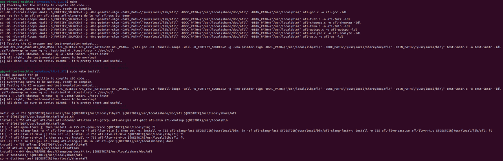
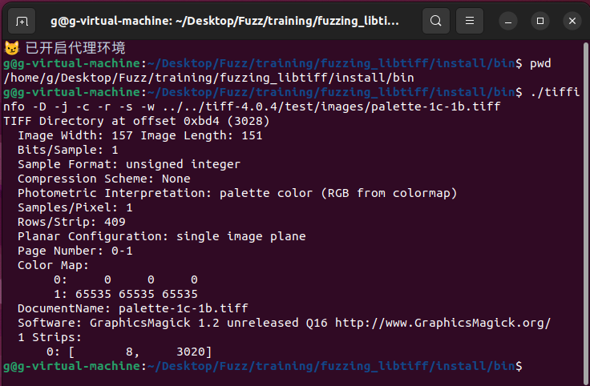
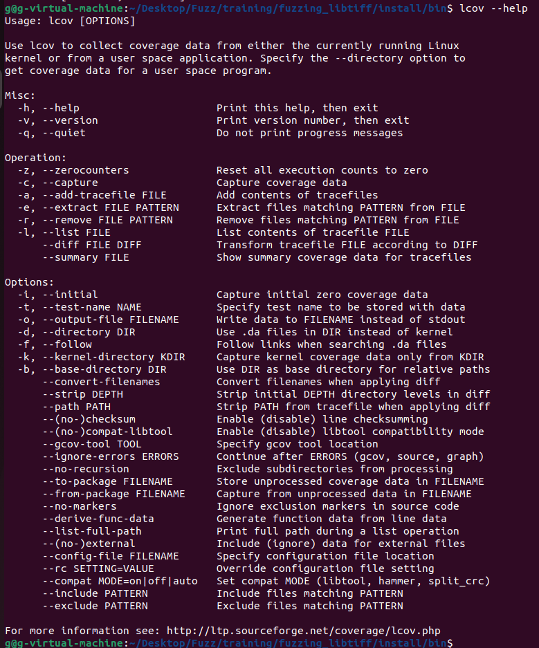
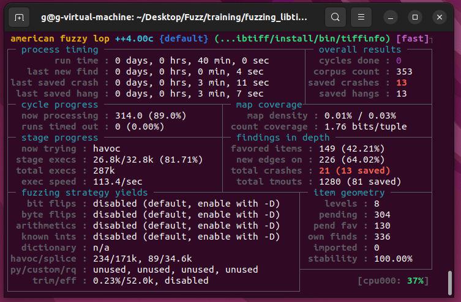
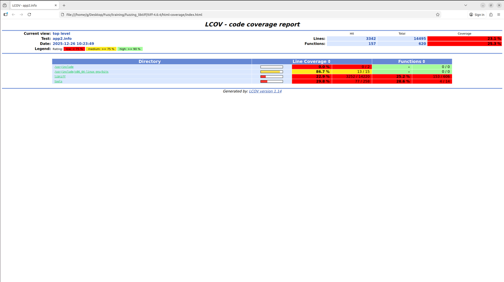
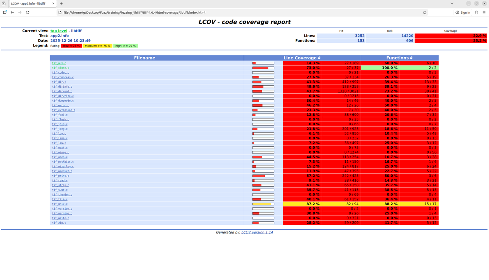
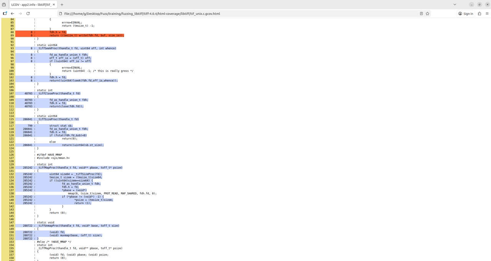
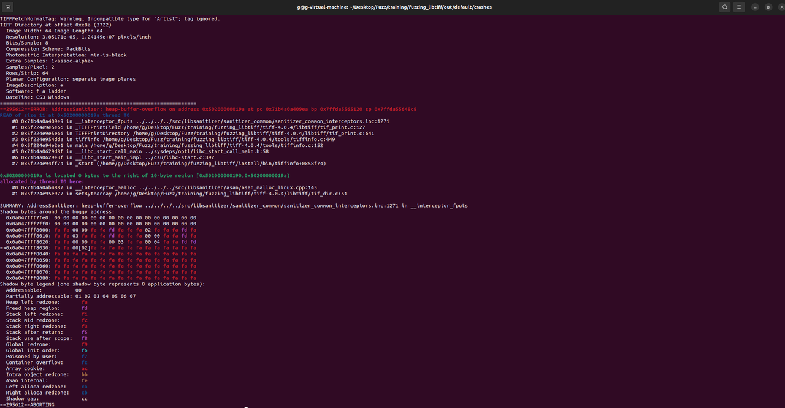

# LibTIFF Fuzzing & Coverage Analysis Lab


本教程记录了针对 **LibTIFF** 进行模糊测试（Fuzzing）的完整流程。涵盖环境搭建、AFL 插桩编译、LCOV 代码覆盖率分析以及 ASan 崩溃分析。

## 📖 目录

- [1. 构建基础环境与安装 AFL](#1-构建基础环境与安装-afl)
- [2. 目标环境配置 (LibTIFF)](#2-目标环境配置-libtiff)
- [3. 代码覆盖率工具 (LCOV)](#3-代码覆盖率工具-lcov-安装)
- [4. 带覆盖率统计的 Fuzzing](#4-带覆盖率统计的-fuzzing)
- [5. 结果分析](#5-结果分析)
  - [代码覆盖率报告](#代码覆盖率报告)
  - [Crash 崩溃分析](#crash-崩溃分析)
- [6. 总结](#6-总结)

---

## 1. 构建基础环境与安装 AFL

首先安装基础编译依赖，并下载安装 AFL (American Fuzzy Lop)。

```bash
# 更新软件源并安装基础编译依赖
sudo apt-get update
sudo apt-get install -y build-essential wget git libtool automake flex bison

# git仓库
git clone [https://github.com/google/AFL.git](https://github.com/google/AFL.git)
cd AFL

# 编译 AFL (包含核心工具 afl-gcc, afl-fuzz, afl-showmap 等)
make
sudo make install
```

> **✅ 验证安装**：编译过程如下图所示，看到 `Build distributed successfully` 即表示 AFL 安装完成。
>
> 

------

## 2. 目标环境配置 (LibTIFF)

**LibTIFF** 是一款广泛使用的处理 TIFF 格式图像的软件。我们需要使用 `afl-gcc` 对其进行汇编级插桩，以便 AFL 捕获分支覆盖率。

```bash
# 返回上层目录
cd ..
# 1.创建目录
cd $HOME/Desktop/Fuzz/training/
mkdir fuzzing_libtiff && cd fuzzing_libtiff/

# 2. 下载并解压包
wget [https://download.osgeo.org/libtiff/tiff-4.0.4.tar.gz](https://download.osgeo.org/libtiff/tiff-4.0.4.tar.gz)
tar -xzvf tiff-4.0.4.tar.gz

# 3. 编译 LibTIFF
cd tiff-4.0.4/

# --disable-shared: 禁用动态库，强制静态链接
./configure --prefix="$HOME/Desktop/Fuzz/training/fuzzing_libtiff/install/" --disable-shared
make -j$(nproc)
make install

# 4. 测试
cd $HOME/Desktop/Fuzz/training/fuzzing_libtiff/install/bin
./tiffinfo -D -j -c -r -s -w ../../tiff-4.0.4/test/images/palette-1c-1b.tiff 
```

> **✅ 验证测试**：出现以下情况，LibTIFF 已正确安装并能正常解析 TIFF 文件，即为测试成功：
>
> 

------

## 3. 代码覆盖率工具 (LCOV) 安装

**代码覆盖率 (Code Coverage)** 能够展示 Fuzzer 已经到达了代码的哪些部分，并可视化 Fuzzing 过程。实验使用 `lcov` 来生成 HTML 报告。

```bash
# install
sudo apt install lcov

# 测试lcov
cd $HOME/Desktop/Fuzz/training/fuzzing_libtiff/install/bin
lcov --help
```

> **✅ 验证安装**：执行 help 命令后，出现如下图所示的帮助信息，即代表安装成功。
>
> 

------

## 4. 带覆盖率统计的 Fuzzing

为了获取覆盖率数据并利用 ASan 检测内存错误，我们需要**重新编译** LibTIFF。

### ⚙️ 编译配置

1. **AFL 插桩**: `CC=afl-gcc`
2. **覆盖率标志**: `CFLAGS="--coverage"`
3. **ASan 开启**: `AFL_USE_ASAN=1`

```
# 1. 清理旧的编译文件
rm -r $HOME/Desktop/Fuzz/training/fuzzing_libtiff/install
cd $HOME/Desktop/Fuzz/training/fuzzing_libtiff/tiff-4.0.4/
make clean

# 2. 配置环境变量与编译
export LLVM_CONFIG="llvm-config-12"
CC=afl-gcc CFLAGS="--coverage" LDFLAGS="--coverage" ./configure --prefix="$HOME/Desktop/Fuzz/training/fuzzing_tiff/install/" --disable-shared

# 开启 AFL_USE_ASAN 并编译安装
AFL_USE_ASAN=1 make -j$(nproc)
AFL_USE_ASAN=1 make install

# 3. 初始化计数器
lcov --zerocounters --directory ./   # 重置计数器
lcov --capture --initial --directory ./ --output-file app.info # 捕获初始状态 (基准线)

# 4. 开始 Fuzzing
afl-fuzz -m none -i $HOME/Desktop/Fuzz/training/fuzzing_libtiff/tiff-4.0.4/test/images/ -o $HOME/Desktop/Fuzz/training/fuzzing_libtiff/out/ -s 123 -- $HOME/Desktop/Fuzz/training/fuzzing_libtiff/install/bin/tiffinfo -D -j -c -r -s -w @@
```

> **🖥️ 运行状态**：AFL 运行界面如下图所示。
>
> 
>
> - `total crashes`: 显示已发现的崩溃数量（图示中发现了 21 个，保存了 13 个）。

Fuzz 一段时间后，按 `Ctrl+C` 停止。

```bash
# 5. 收集 Fuzz 后的覆盖率数据
# --no-checksum: 加快处理速度
lcov --no-checksum --directory ./ --capture --output-file app2.info

# 6. 生成 HTML 报告
genhtml --highlight --legend -output-directory ./html-coverage/ ./app2.info
```

> **📊 数据收集**：收集过程如下图所示，可以看到它正在处理各个 `.gcda` 文件。
>
> 

------

## 5. 结果分析

### 代码覆盖率报告

打开 `html-coverage/index.html`，可以直观地看到 Fuzz 的效果。

#### 1. 总览 (Overview)



可以看到整体的行覆盖率 (Line Coverage) 和函数覆盖率 (Functions)。

- 🟥 **红色条**: 覆盖率低 (Low)。
- 🟩 **黄色/绿色**: 覆盖率较高。

#### 2. 文件列表详情

列出了 `libtiff` 目录下每个 `.c` 文件的具体覆盖情况。



> 💡 例如 `tif_dir.c` 覆盖了 41.3%，而 `tif_compress.c` 只有 27.6%。

#### 3. 代码行详情

点击具体文件（如 `tif_close.c` 或 `tif_unix.c`），可以看到源代码视图。



- **蓝色背景**: 表示该行被执行了。
- **红色背景**: 表示未被执行。

------

### Crash 崩溃分析

AFL 发现的崩溃样本保存在 `out/default/crashes` 目录下。我们需要结合 **ASan (AddressSanitizer)** 来分析触发原因。

```bash
# 进入 Crash 目录
cd $HOME/Desktop/Fuzz/training/fuzzing_libtiff/out/default/crashes

# 重现崩溃 (使用带 ASan 的程序)
../../../install/bin//tiffinfo -D -j -c -r -s -w id:000000,sig:06,src:000106+000012,time:807473,execs:95657,op:splice,rep:8
```

> **🐞 ASan 追踪结果**: 运行后，ASan 捕获异常并输出详细报告。
>
> 

通过ASan的定位，我们可以知道，存在一个heap-buffer-overflow (堆缓冲区溢出)的问题，且问题发生在 _interceptor_fputs 及 TIFFPrintField 函数中。内存映射图展示了溢出发生的具体内存地址状态。
通过这个堆栈跟踪 (Stack Trace)，开发人员可以精确定位到是哪一行代码处理恶意 TIFF 文件时发生了越界写入。
现在可以在重现 crash 的前提下，再加上 lcov 提供的代码覆盖率，就可以更轻松地去定位漏洞触发的原因了。

------

## 6. 总结

1. **覆盖率引导优化**: 单纯运行 AFL 只能看到"崩溃了"，但通过 LCOV 我们能看到"测了哪里，没测哪里"。
2. **性能权衡**: 在测试中，我们使用了 `gcc` 配合 `--coverage` 进行编译。这会显著降低 Fuzz 的执行速度。一种思路是先用高性能模式 (不带 coverage) 跑出大量路径，然后偶尔用带 coverage 的版本跑一次现有语料库 (Corpus) 以评估进度。
3. **ASan 的重要性**: 如果不开启 ASan，很多内存越界读取可能不会导致程序立即崩溃 (Crash)，从而被 Fuzzer 忽略。开启 ASan 虽然消耗内存，但能让漏洞发现率成倍提升。

---

## 🔗 参考资料 (References)

本教程的部分步骤和思路参考了以下优秀的开源资源：

### 🛠️ 工具与文档

* **AFL (American Fuzzy Lop)**: [Google/AFL GitHub](https://github.com/google/AFL) - 本教程使用的核心 Fuzzing 工具。特别感谢 **Google AFL Team** 开发了如此强大的测试工具。
* **LCOV**: [LCOV Documentation](https://lcov.readthedocs.io/en/latest/index.html) - GCC 代码覆盖率前端工具。
* **AddressSanitizer (ASan)**: [Google Sanitizers Wiki](https://github.com/google/sanitizers/wiki/AddressSanitizer) - 用于检测内存错误的编译器插件。

### 🎯 目标软件

* **LibTIFF**: [Official Website](http://www.libtiff.org/) - LibTIFF 官方网站。
* **Source Code**: [LibTIFF 4.0.4 Download](https://download.osgeo.org/libtiff/tiff-4.0.4.tar.gz) - 本教程使用的具体版本源码。

### 📚 扩展阅读

* **AFL README**: [AFL Technical Details](https://github.com/google/AFL/blob/master/docs/technical_details.txt) - 深入了解 AFL 的工作原理。
* **Fuzzing 101**: [GitHub - antonio-morales/Fuzzing101](https://github.com/antonio-morales/Fuzzing101) - 提供了基础的 Fuzzing 流程思路。更多关于 LibTIFF 和其他目标的 Fuzzing 练习。
